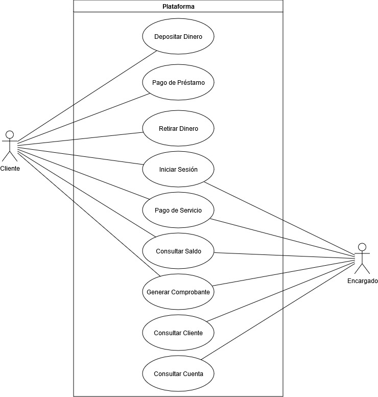

# Manual Técnico

## Core del negocio

La compañia Money Bin es una institucion financiera que ofrece diferentes servicios bancarios a sus afiliados y clientes en toda Guatemala, esto conlleva a que la empresa maneja un gran volumen de transacciones
por lo que la compañia a marcado el objetivo de mejorar la atencion al cliente y la optimizacion de sus recursos por lo que nace la idea de la implementacion de una plataforma, que se centra en brindar a los diferentes establecimientos afiliados a la compañia y a los propios clientes no solo mejorar los tiempo al eliminar la necesidad de sucursales asi como ofrecer una forma inovadora en la manera en que se realizan las diferentes transacciones bancarias. La plataforma les permite realizar diferentes acciones bancarias dentro estas funcionalidades se resumen en:

**Pago de servicio**: Los clientes solicitan al encargado el pago de un servicio como agua, luz, telefono o internet y el encargado dentro de la plataforma registra el pago del servico.
**Pago de prestamos**: Los clientes solicitan al encargado el pago de un prestamo con saldo pendiente y el encargado dentro de la plataforma registra el pago del parcial o completo del prestamo.
**Retiro y deposito de dinero**: Los clientes solicitan al encargado retirar o depositar dinero a sus cuentas.
**Generacion de comprobantes**: Los encargado pueden generar reportes sobre el detalle de las transacciones de los clientes.
**Busqueda de cuentas y clientes**: Los encargados pueden realizar busquedas de manera instantanea de la informacion del cliente e informacion sus cuentas.
**Consulta de saldos**: Los clientes solicitan la consulta de saldos en sus cuentas.

## Casos de Uso de Alto Nivel

## Requerimientos Funcionales

**Inicio de sesion**: El usuario puede ingresar a la plataforma ingresando su CUI y contraseña.

**Registro de usuario**: Los usuario pueden registrarse en el aplicativo ingresando su informacion persoanal.

**Pago de servicios**: Los usuarios pueden realizar pagos de diferentes diferentes servicios dentro del plataforma ingresando diferentes datos para realizarlo.

**Pago de prestamos**: Los usuarios pueden realizar pagos de prestamos de manera parcial o total.

**Buscar cuentas**: Los usuarios pueden realizar busquedas de clientes por medio del CUI del cliente o por medio del numero de cuenta del cliente.

**Visualizar cliente**: Los usuarios pueden realizar la busqueda de clientes y visualizar la informacion de contacto e historial de transacciones.

**Consultar saldo**: Los usuarios pueden consultar los saldos de sus cuentas bancarias.

**Generar comprobante**: Los usuarios pueden generar un reporte PDF que resuma su historial de transacciones bancarias.

**Retiro de dinero**: Los usuarios pueden realizar retiros de dinero de sus cuentas bancarias.

**Deposito de dinero**: Los usuarios pueden realizar depositos de dinero en sus cuentas bancarias.

## Requerimientos No Funcionales

**Seguridad de la informacion**: La informacion de los usuarios no debe ser comprometida en ningun momento.

**Cifrado**: Toda la informacion de la plataforma al ser transmitida debe estar cifrada.

**Interfaz responsive**: La interfaz de la plataforma debe adaptarse a las pantallas de diferentes dispositivo.

**Concurrencia**: La plataforma debe manejar una gran cantidad de transacciones en paralelo.

**Prevención de fraudes**: La plataforma debe poder identificar anomalias de fraude en las transacciones.

**Accesibilidad**: La interfaz de la plataforma debe ser intuitiva y facil de utilizar.

## CDU expandidos

## Arquitectura candidata

## Diagrama entidad relación

## Endpoints

## Configuración del Entorno

## Instalación y Despliegue