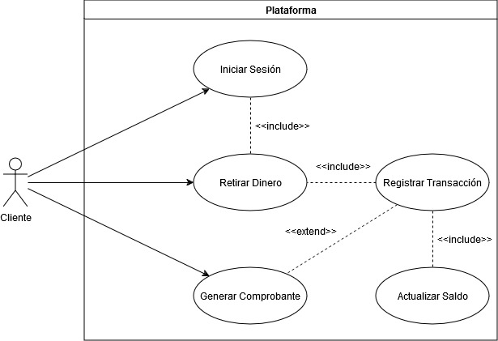
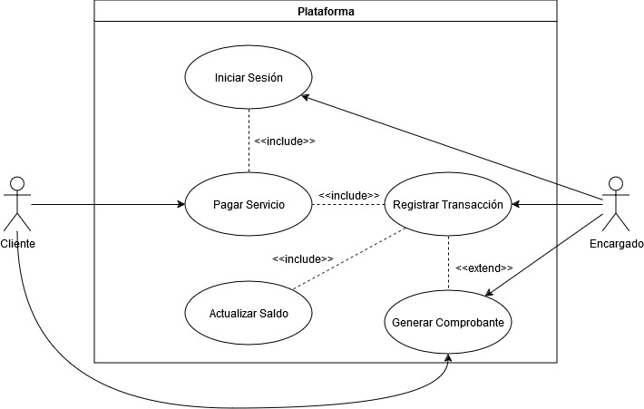
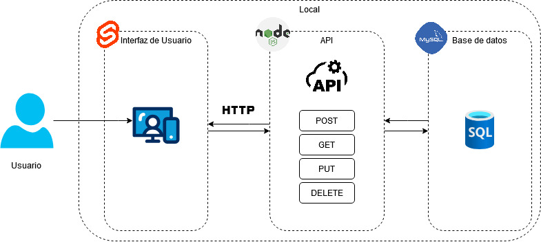

# Manual Técnico

## Core del negocio

La compañia Money Bin es una institucion financiera que ofrece una gran gama servicios bancarios a sus afiliados y clientes en toda Guatemala, teniendo en sus pilares la seguridad,
esto conlleva a que la empresa maneja un gran volumen de transacciones y clientes donde se ha notado una gran carga que ha impactado las experiencia de los clientes
por lo tanto se ha marcado el objetivo de mejorar la atencion al cliente y la optimizacion de los recursos con la implementacion de una plataforma bancaria, 
que se centra en brindar a los diferentes establecimientos afiliados a la compañia y a los propios clientes no solo mejorar los tiempo, al eliminar la necesidad de sucursales, sino que
tambien ofrecer una forma inovadora en la manera en que se realizan las diferentes transacciones bancarias. Los servicios los cuales ofrece la compañia y los cuales se busca prestar dentro de la plataforma son:
- **Pago de servicio**
- **Pago de prestamos**
- **Retiro y deposito de dinero**
- **Generacion de comprobantes**
- **Busqueda de cuentas y clientes**
- **Consulta de saldos**

## Casos de Uso de Alto Nivel

### Descomposicion Casos de Uso de Alto Nivel

## Requerimientos Funcionales

1. **Inicio de sesion**: El usuario puede ingresar a la plataforma ingresando su CUI y contraseña.

2. **Registro de usuario**: Los usuarios pueden registrarse en el aplicativo ingresando su informacion persoanal.

3. **Pago de servicios**: Los encargados pueden aplicar pagos de diferentes diferentes servicios dentro del plataforma en nombre del cliente.

4. **Pago de prestamos**: Los clientes pueden realizar pagos de prestamos de manera parcial o total.

5. **Buscar cuentas**: Los encargados pueden realizar busquedas de clientes por medio del CUI del cliente o por medio del numero de cuenta del cliente.

6. **Consultar cliente**: Los encargados pueden realizar la busqueda de clientes y visualizar la informacion de contacto e historial de transacciones.

7. **Consultar saldo**: Los clientes pueden consultar los saldos de sus cuentas bancarias.

8. **Generar comprobante**: Los usuarios pueden obtener un reporte PDF de sus transacciones bancarias.

9. **Retiro de dinero**: Los clientes pueden realizar retiros de dinero de sus cuentas bancarias.

10. **Deposito de dinero**: Los clientes pueden realizar depositos de dinero en sus cuentas bancarias.

## Requerimientos No Funcionales

1. **Seguridad de la informacion**: La informacion de los usuarios no debe ser comprometida en ningun momento.

2. **Cifrado**: Toda la informacion de la plataforma al ser transmitida debe estar cifrada.

3. **Interfaz responsive**: La interfaz de la plataforma debe adaptarse a las pantallas de diferentes dispositivo.

4. **Concurrencia**: La plataforma debe manejar una gran cantidad de transacciones en paralelo.

5. **Prevención de fraudes**: La plataforma debe poder identificar anomalias de fraude en las transacciones.

6. **Accesibilidad**: La interfaz de la plataforma debe ser intuitiva y facil de utilizar.

## Casos de Uso Expandidos

**Caso de Uso**: Inicio de sesion\
**Actores**: Cliente, Responsable\
**Tipo**: Proporcionar un inicio de sesion dentro de la plataforma\
**Proposito**: Primario\
**Descripcion**: Los usuarios ingresan al login de la plataforma con sus datos personales para acceder a las funcionalidades.

**Caso de Uso**: Inicio de sesion\
**Actores**: Cliente, Responsable\
**Tipo**: Proporcionar un inicio de sesion dentro de la plataforma\
**Proposito**: Primario\
**Descripcion**: Los usuarios ingresan al registro de la plataforma e ingresas sus datos personales para registrarse en la plataforma.

**Caso de Uso**: Pago de servicio\
**Actores**: Cliente, Responsable\
**Tipo**: Primario\
**Proposito**: Ofrecer el servicio para el pago de diferentes servicios\
**Descripcion**: El cliente se presenta a una suscursal afiliada y solicita al encargado realizar el pago
de algun servicio como agua, luz, internet, o telefono. El encargado ingresa su nombre,
el codigo del servicio y el monto a pagar, una vez realizado se registra la transaccion del pago del servicio en la plataforma.

**Caso de Uso**: Pago de prestamos\
**Actores**: Cliente\
**Tipo**: Primario\
**Proposito**: Ofrecer el servicio para el pago de prestamos del cliente\
**Descripcion**: El cliente dentro de la plataforma solicita realizar el pago de
un prestamo registrado a su nombre, ya sea de un pago parcial o un pago completo, 
el cliente ingresa el numero de cuenta, el numero del prestamo, el monto a pagar y la fecha de pago, 
una vez realizado se registra la transaccion del pago y se aplica al saldo del prestamo dentro de la plataforma.

**Caso de Uso**: Retiro de dinero\
**Actores**: Cliente\
**Tipo**: Primario\
**Proposito**: Ofrecer el servicio para el retiro de dinero de cuentas\
**Descripcion**: El cliente dentro de la plataforma solicita retirar efectivo de su cuenta, 
el cliente ingresa el numero de cuenta, el monto a retirar, el tipo de retiro
y la fecha y hora del retiro, una vez realizado se registra la transaccion de retiro de dinero a la cuenta del cliente
y se actualiza el saldo de la misma.

**Caso de Uso**: Retiro de dinero\
**Actores**: Cliente\
**Tipo**: Secundario\
**Proposito**: Validar el monto de retiro de dinero de cuentas\
**Descripcion**: El cliente dentro de la plataforma solicita retirar efectivo de su cuenta, 
el cliente ingresa el numero de cuenta, el monto a retirar, el tipo de retiro
y la fecha y hora del retiro, una vez realizado la plataforma detecta que la cantidad ingresada supera
la cantidad limite disponible para retirar de la cuenta del cliente y aborta la transaccion.

**Caso de Uso**: Deposito de dinero\
**Actores**: Cliente\
**Tipo**: Primario\
**Proposito**: Ofrecer el servicio para el deposito de dinero de cuentas\
**Descripcion**: El cliente dentro de la plataforma solicita depositar dinero a su cuenta, 
el cliente ingresa el numero de cuenta, el monto a depositar, el metodo de deposito
y la fecha y hora del deposito, una vez realizado se registra la transaccion de deposito a la cuenta del cliente
y se actualiza el saldo de la misma dentro de la plataforma.

**Caso de Uso**: Consultar saldo\
**Actores**: Cliente, Encargado\
**Tipo**: Primario\
**Proposito**: Ofrecer un servicio para consultar saldos de las cuentas\
**Descripcion**: Los usuarios dentro de la plataforma solicitan consultar el saldo de una cuenta, el usuario ingresan el numero de cuenta y se depliegua el saldo actual de la cuenta y la ultima fecha en la que se
actualizo el saldo de la cuenta.

**Caso de Uso**: Consultar Cliente\
**Actores**: Encargado\
**Tipo**: Primario\
**Proposito**: Ofrecer un servicio de consulta rapida de clientes\
**Descripcion**: El encargado dentro de la plataforma solicita consultar un cliente, el encargado ingresa
el numero de cuenta de cliente o el CUI del cliente y la plataforma de rapida manera muestra la informacion del cliente.

**Caso de Uso**: Generar comprobante\
**Actores**: Cliente, Encargado\
**Tipo**: Primario\
**Proposito**: Ofrecer comprobantes del detalle de transacciones\
**Descripcion**: Los usuarios dentro de la plataforma registran una transaccion, la plataforma automaticamente
genera un reporte en PDF detallando algunso datos de la transaccion como
el numero de cuenta, el tipo de transaccion, fecha y hora, monto, nombre y la firma del encargado.

## Arquitectura candidata (Diagrama de Bloques)

## Diagrama entidad relación

## Endpoints

## Configuración del Entorno

Para la configuración del entorno se necesitan realizar las siguientes instalaciones de forma local:

Se necesita instalar `Nodejs` en su version `18.18.0`, asi como `npm` en su version mas reciente. Adicional a ello se necesita instalar las siguientes liberias con npm: express, mysql2, cors, promise y express, compatibles con la version de node anteriormente mencionada, asi como los paquetes de `Svelte` en su version 5.

Para el entorno de la base de datos se necesita instalar y configurar `Docker` y `Docker Compose` en su ultima version, con ellos se necesita descargar la imagen `latest` de `mysql` de docker hub.

Cumpliendo los requisitos posteriormente mencionados se puede proceder con la instalacion y despliegue de la apliacion.

## Instalación y Despliegue