# Manual Usuario

## Requisitos del Sistema

#### **Hardware Requerido**
1. **Servidor o PC Local:**
   - Procesador: Intel i5 o superior / AMD Ryzen 3 o superior.
   - Memoria RAM: Mínimo 8 GB (recomendado 16 GB para entornos de desarrollo o múltiples contenedores).
   - Almacenamiento: 20 GB de espacio libre en disco.
   - Conexión a Internet: Requerida para descargar dependencias y actualizaciones.

2. **Clientes (Navegadores):**
   - Navegador compatible: Chrome (v95 o superior), Firefox (v90 o superior), Microsoft Edge (v90 o superior).
   - Resolución de pantalla: 1366x768 (recomendado Full HD o superior).

#### **Software Requerido**
1. **Sistema Operativo:**
   - Windows 10 o superior.
   - Ubuntu 20.04 LTS o superior.
   - macOS Mojave o superior.

2. **Herramientas de Desarrollo:**
   - Node.js (v18.0.0 o superior) y npm (v8.0.0 o superior).
   - Docker (v20.10.0 o superior) y Docker Compose.
   - Git (opcional, para clonar repositorios).

3. **Base de Datos:**
   - Motor MySQL o MariaDB (para pruebas locales sin contenedor).

## Instalación

#### **Paso 1: Preparación del Entorno**
1. Verifique que los requisitos de hardware y software estén cumplidos.
2. Instale las herramientas necesarias:
   - [Node.js](https://nodejs.org) (incluye npm).
   - [Docker](https://www.docker.com) y Docker Compose.

#### **Paso 2: Instalación del Frontend**
1. Navegue a la carpeta donde se encuentra el archivo `package.json` del frontend.
2. Ejecute:
   ```bash
   npm install
   ```
   Este comando descargará e instalará las dependencias necesarias.

#### **Paso 3: Instalación del Backend**
1. Repita el paso anterior en la carpeta correspondiente al backend.
2. Asegúrese de que las dependencias se instalen sin errores.

#### **Paso 4: Configuración de la Base de Datos**
1. Ejecute el siguiente comando para iniciar el contenedor de la base de datos:
   ```bash
   docker-compose -f docker-compose.yaml up -d
   ```
2. Una vez iniciado, importe el esquema y los datos iniciales ejecutando el script SQL ubicado en:
   ```
   practica/Database/script_complete.sql
   ```

#### **Paso 5: Despliegue del Sistema**
1. Inicie tanto el frontend como el backend ejecutando:
   ```bash
   npm run dev
   ```
   Esto levantará los servidores en sus respectivos puertos locales definidos.

2. Acceda a la aplicación desde su navegador ingresando a la dirección:
   ```
   http://localhost:<puerto>
   ```

## Descripción de la Interfaz de usuario
### Administrador
1. Pantalla de Inicio: Acceso rápido a módulos de administración, como gestión de usuarios y operaciones bancarias.
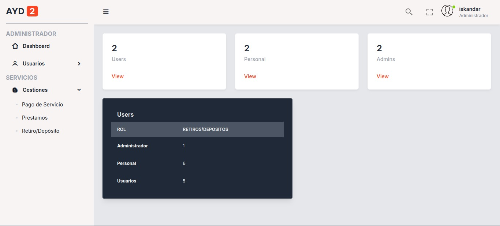

2. Gestión de Usuarios: Permite al administrador buscar y visualizar usuarios utilizando el número de cuenta o CUI. En esta pantalla se muestran detalles clave como nombres, saldo disponible (si está habilitado), y su historial de transacciones. Opcionalmente, se puede deshabilitar la visualización directa del saldo por cuestiones de privacidad.
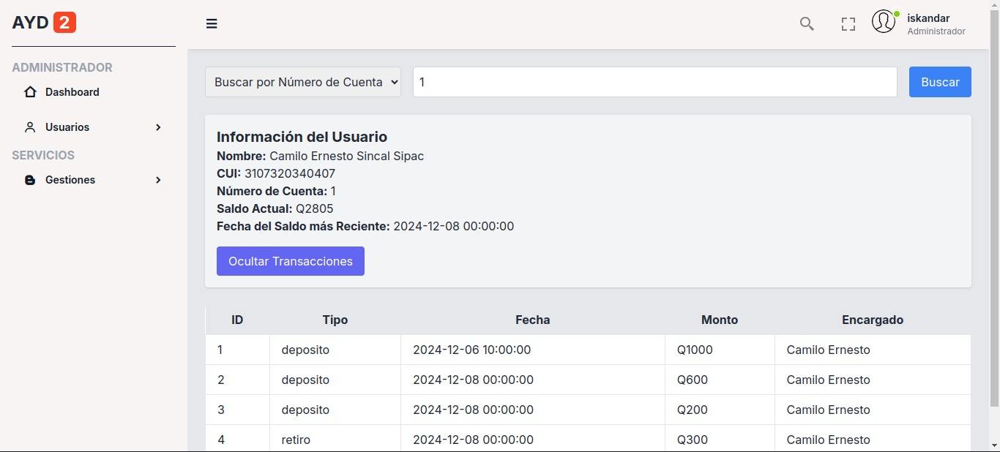
3. Pago Servicios: Diseñado para procesar pagos de servicios básicos como agua, luz, teléfono e internet. La interfaz solicita datos como el nombre del cliente, código del servicio, y monto a pagar. Incluye validaciones para garantizar que los datos ingresados sean correctos antes de confirmar la transacción.
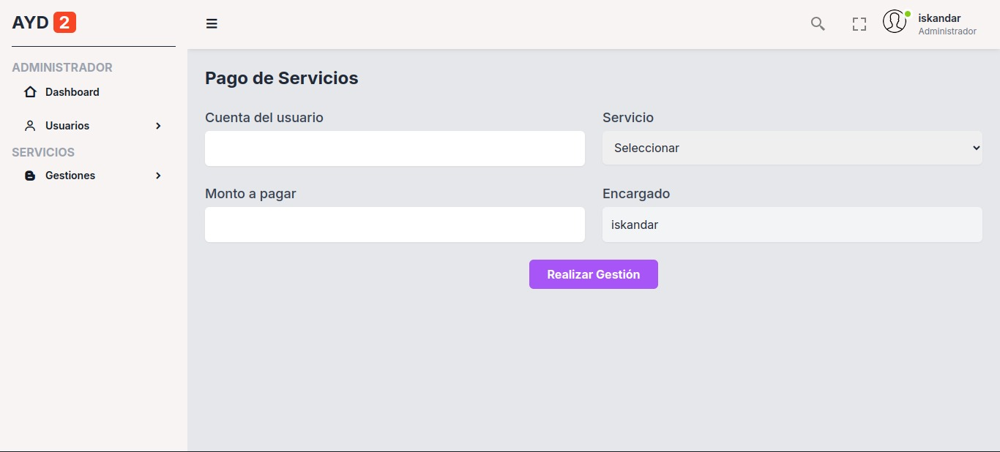
4. Solicitud de Préstamos: Permite a los administradores registrar solicitudes de préstamos realizadas por clientes. Requiere el número de cuenta del cliente y monto solicitado, además valida los requisitos del cliente antes de aprobar el préstamo.
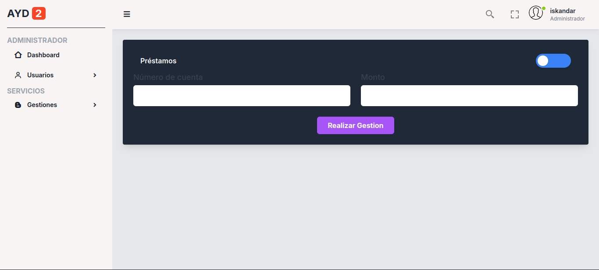
5. Pagos de prestamos: Facilita el registro de pagos parciales o totales de préstamos adquiridos. Incluye campos para número de cuenta, número de préstamo, monto a pagar y fecha de pago. Aplica el pago automáticamente al saldo del préstamo y genera un comprobante de la operación.
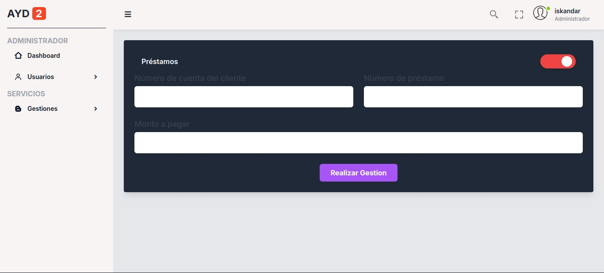
6. Depósitos: Esta pantalla permite registrar depósitos realizados en la cuenta del cliente. Solicita el número de cuenta, monto del depósito y método utilizado (efectivo o transferencia). Actualiza el saldo del cliente en tiempo real.
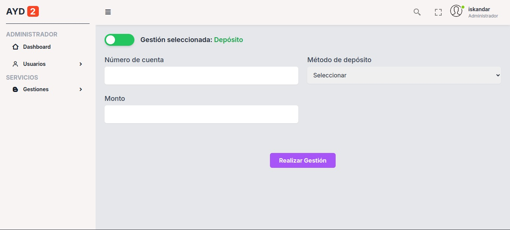
7. Retiro: Proporciona las opciones para registrar retiros de efectivo realizados por el cliente. Incluye información como número de cuenta, monto, tipo de retiro (ventanilla o cajero automático) y validaciones de límites diarios.
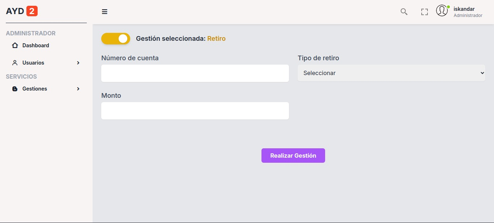
## Usuario
1. Dashboard: Muestra un resumen de la actividad de la cuenta del cliente, incluyendo el saldo actual y transacciones recientes. Acceso directo a funcionalidades clave como depósitos, retiros y pagos de préstamos.
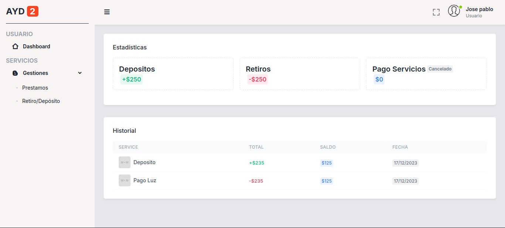
2. Pago de Préstamos: Permite a los clientes realizar pagos parciales o totales de sus préstamos directamente desde su cuenta. Solicita información como número de préstamo, monto a pagar y fecha de pago.
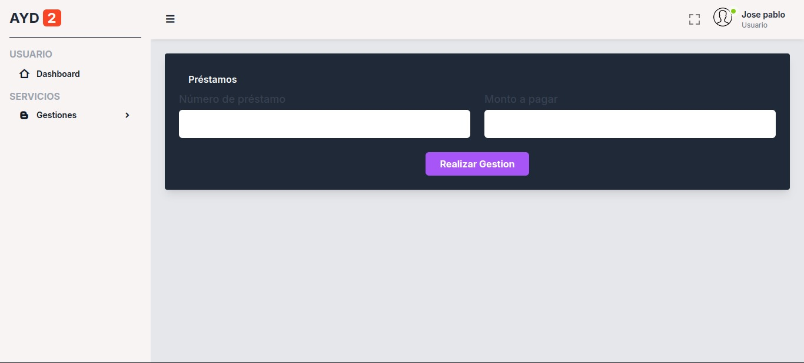
3. Depósitos: Diseñado para que los clientes realicen depósitos en su cuenta de manera autónoma. La pantalla solicita el monto y confirma la actualización del saldo en tiempo real.
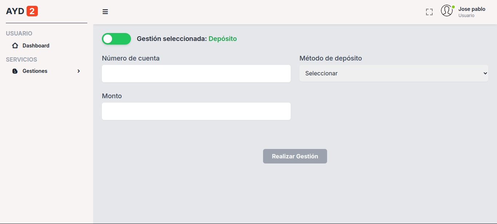
4. Retiros: Facilita los retiros directos desde la cuenta del cliente, proporcionando opciones de tipo de retiro y validaciones de seguridad.
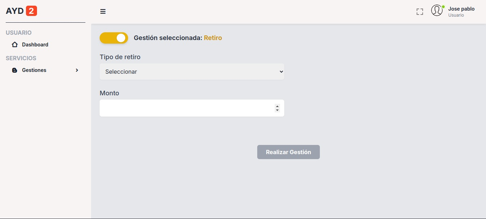